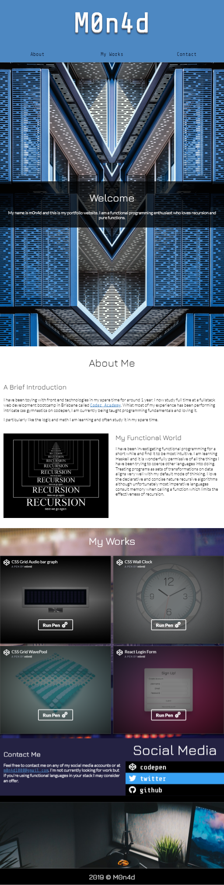
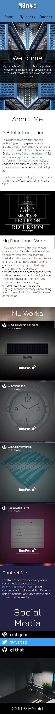
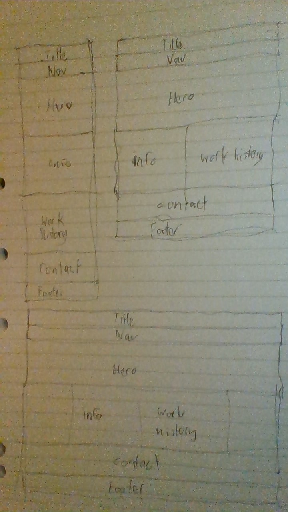
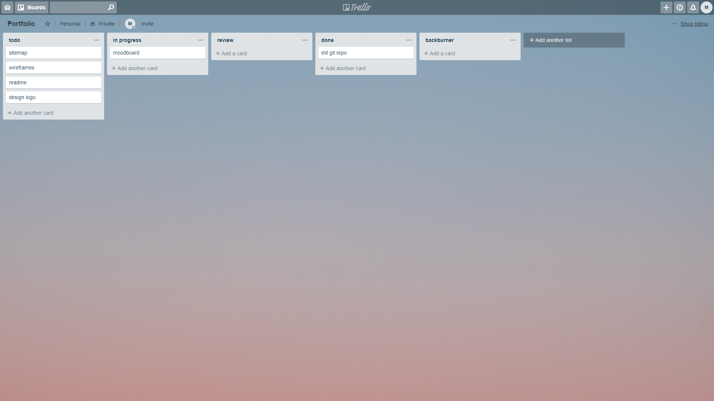
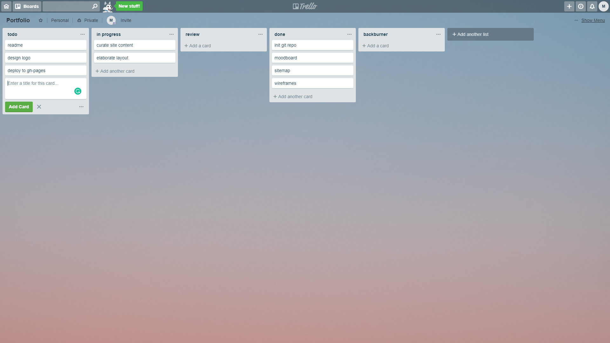
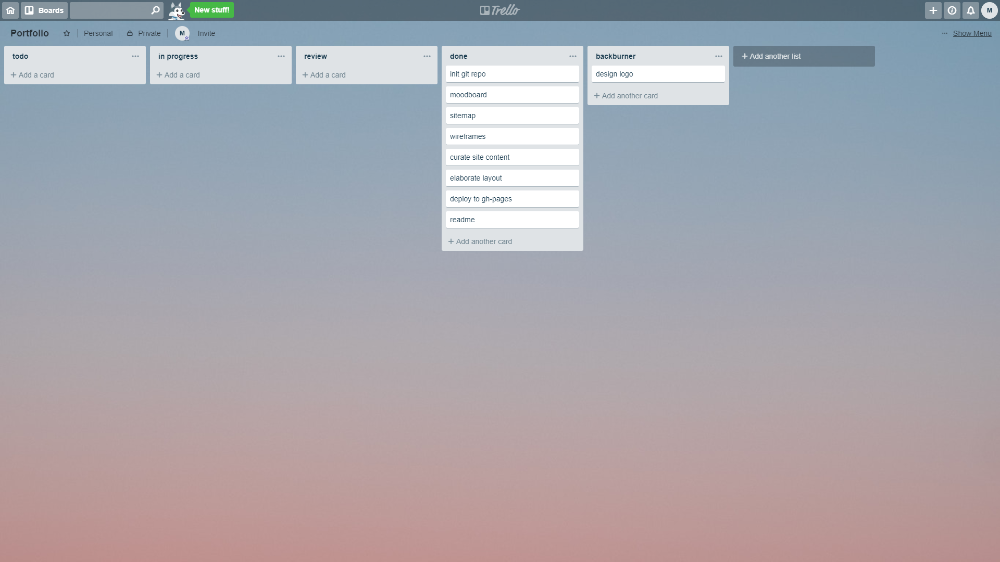

# My Portfolio

## [Github Repo](https://github.com/m0n4d1/portfolio)

## [Live Site](https://m0n4d1.github.io/portfolio)

## Portfolio website Description

### Purpose

A basic showcase of my work and overview of my interests programmer.

### Functionality / features

Basic single page with a sticky navigation bar linking to sections within the page.

### Sitemap

Single page - Home

### Screenshots

#### Laptop layout

#### Tablet layout

#### Mobile layout

### Target audience

Web developers, Employers

### Tech stack (e.g. html, css, deployment platform, etc)

Html, Scss, gh-pages

## Design documentation

### Design process

The design process for this project was very straight forward. Build moodboard -> draw wireframes -> prototype -> iterate until complete.

### Wireframes

### Usability considerations

Site was designed responsive for viewports > 300px

### Project plan & timeline

- 19/march/2019: Moodboard
- 20/march/2019: Wireframes
- 21/march/2019: Prototype
- 22/march/2019: Elaborate styles and layout
- 23/march/2019: Deploy to gh-pages

### Screenshots of Trello board

